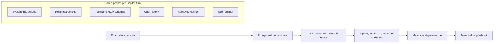
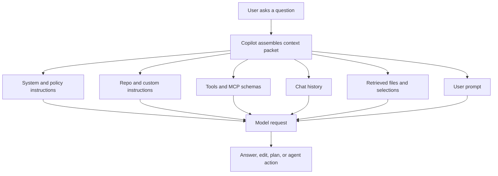

# GitHub Copilot Token Optimization Workshop

## Reduce Cost, Improve Response Quality, Scale AI Usage

Customer-ready, instructor-led, hands-on workshop package for enterprise engineering teams adopting GitHub Copilot at scale.

> Looking for the workshop structure similar to the reference repo? Start with [workshop/README.md](workshop/README.md), then follow [workshop/exercise-1.md](workshop/exercise-1.md) through [workshop/exercise-10.md](workshop/exercise-10.md). A consolidated CLI path is available at [workshop/exercise-cli.md](workshop/exercise-cli.md).

> The hands-on starter app is included in this same folder. See [DEMO_APP.md](DEMO_APP.md) for setup commands and the file map used by each exercise.

### Source Alignment

This workshop is aligned with the GitHub Copilot token optimization guidance at <https://aka.ms/ghcp-tkn-opt>, GitHub Copilot documentation at <https://docs.github.com/en/copilot>, and workshop patterns from the Microsoft GHCP Lab at <https://github.com/microsoft/GHCP-Lab>.

Key guidance reinforced throughout the labs:

| Optimization lever | Practical rule |
| --- | --- |
| Scope context | Prefer `#selection`, `#file`, `#changes`, and `#problems` before `#codebase`. |
| Reduce prompt bloat | Use concise, structured, goal-oriented prompts. |
| Reuse stable instructions | Keep durable repo guidance in short instruction files so it can be reused and cached. |
| Control output | Ask for the exact answer shape, length, and artifact needed. |
| Right-size workflow mode | Use Ask for quick lookup, Edit for scoped edits, Agent for multi-step work. |
| Right-size models/tools | Use stronger models and broad tool access only when task complexity requires them. |
| Reset context | Start a new chat when the task changes to avoid history carrying forward. |

## 1. Workshop Overview

### Target Audience

| Audience | Why they attend |
| --- | --- |
| Enterprise developers | Improve Copilot quality while reducing wasted context and repeated prompting. |
| Tech leads and architects | Design scalable AI-assisted workflows for large repositories. |
| Engineering managers | Understand cost, productivity, and governance tradeoffs. |
| DevOps and platform teams | Optimize Copilot usage across CLI, CI/CD, MCP, and custom agent workflows. |
| Developer productivity teams | Build reusable guidance, prompt templates, and governance practices. |

### Prerequisites

- GitHub Copilot access for VS Code and GitHub.com.
- VS Code with GitHub Copilot Chat enabled.
- GitHub CLI installed; Copilot CLI extension recommended where available.
- Basic knowledge of Git, pull requests, APIs, frontend components, CI/CD, and enterprise repositories.
- Optional: MCP-capable Copilot environment for Exercise 7.

### Duration

| Delivery option | Format | Recommended agenda |
| --- | --- | --- |
| 1-day workshop | 6.5 hours plus breaks | Fundamentals, 10 labs, governance wrap-up, executive readout. |
| 2 half-day sessions | 3.25 hours each | Day 1: fundamentals and Exercises 1-5. Day 2: Exercises 6-10 and governance. |

### Learning Outcomes

Participants will be able to:

1. Explain how input, cached, output, history, tool, MCP, and retrieved-context tokens affect cost and quality.
2. Rewrite vague prompts into concise, scoped, high-quality prompts.
3. Select the smallest useful Copilot context for a task.
4. Use instructions, reusable prompts, skills, custom agents, and MCP in token-efficient ways.
5. Optimize Copilot usage across Chat, inline completions, Agent mode, CLI prompts, and multi-file workflows.
6. Measure token savings with before/after estimates and team-level scorecards.
7. Establish enterprise governance practices for sustainable Copilot adoption.

### Required Tools

| Tool | Used for |
| --- | --- |
| VS Code | Primary workshop IDE. |
| GitHub Copilot Chat | Ask, Edit, Agent, context references, prompt history. |
| GitHub CLI plus Copilot CLI | Command-line prompt examples and workflow automation. |
| Git | Branching, diffs, pull requests, change scoping. |
| Optional MCP server | External context and schema-tax demonstrations. |
| Spreadsheet or BI mockup | Metrics dashboard exercise. |

### Workshop Architecture

### Repository Structure

Use the demo repository structure described in [demo-repo-structure.md](demo-repo-structure.md). The structure models a large enterprise application with backend APIs, frontend components, database scripts, CI/CD, documentation, legacy code, and team ownership boundaries.

### Suggested Delivery Mode

- Instructor-led walkthrough with live Copilot demonstrations.
- Pair or small-group lab work.
- Before/after prompt reviews at the end of each module.
- Measured token-efficiency scorecards, not only subjective quality feedback.

### Instructor Preparation Checklist

- [ ] Confirm every participant has Copilot access in VS Code.
- [ ] Clone or create the demo repository structure.
- [ ] Validate Chat, Edit, Agent, CLI, and optional MCP features in the delivery tenant.
- [ ] Prepare a baseline prompt pack with intentionally inefficient prompts.
- [ ] Prepare a spreadsheet for token estimates and optimization scorecards.
- [ ] Review enterprise policy boundaries for data sharing, secrets, and repository access.
- [ ] Decide which model options and agent features are available in the customer environment.

## 2. Token Optimization Fundamentals

### What Tokens Are

Tokens are the chunks of text, code, metadata, tool descriptions, history, and output that a model processes. A token may be a word, part of a word, punctuation, whitespace, or code fragment. In Copilot workflows, the prompt the user types is often the smallest part of the full request.

### Input vs Output vs Cached Tokens

| Token type | What it includes | Optimization lever |
| --- | --- | --- |
| Input tokens | User prompt, selected code, retrieved files, instructions, chat history, tool schemas. | Scope, compress, remove unused tools, start fresh sessions. |
| Cached tokens | Stable repeated prefixes such as durable instructions. | Keep stable instructions byte-consistent and concise. |
| Output tokens | Copilot's visible response and model reasoning work. | Ask for bounded output, exact formats, and concise answers. |

### Why Optimization Matters

Token optimization improves three things at once:

- Cost: fewer unnecessary input, history, schema, and output tokens.
- Quality: smaller, more relevant context reduces conflicting signals.
- Speed: less context often means faster responses and fewer repair turns.

### Analogy

Think of Copilot context like a meeting invite. A good invite includes the right people, agenda, decision needed, and materials. A bad invite forwards a year of email threads and asks everyone to “figure it out.” Both can produce an answer, but only one scales.

### Context Packet Diagram

### Enterprise Examples

| Scenario | Inefficient pattern | Optimized pattern |
| --- | --- | --- |
| Large monorepo bug | “Check the whole repo and fix checkout.” | “Why does this assertion fail? `#file:checkout.test.ts` `#file:checkout.ts`.” |
| Architecture review | Agent mode with every tool enabled. | Ask mode for summary, Plan mode for approach, Agent only for scoped implementation. |
| Repeated team prompts | Paste the same coding standards into every chat. | Store concise standards in `.github/copilot-instructions.md` and task prompts in reusable templates. |
| MCP usage | Enable all enterprise tools by default. | Enable only tools needed for current workflow and summarize external context before injection. |

## 3. Workshop Scenario

### Enterprise Storyline

Contoso Retail Banking is modernizing and maintaining a large enterprise application called **Unified Benefits Banking**. The application supports employee benefits, card payments, claims, merchant settlement, reporting, and partner integrations. Multiple teams use GitHub Copilot to accelerate delivery, but token usage and response inconsistency have increased as adoption scales.

The engineering organization wants to reduce unnecessary token consumption, improve Copilot answer quality, and create reusable workflows for safe AI-assisted development.

### Application Landscape

| Area | Example components |
| --- | --- |
| Backend APIs | `payments-api`, `claims-api`, `identity-api`, `notification-api`. |
| Frontend | React admin portal, customer dashboard, shared design system. |
| Database | Postgres migrations, stored procedures, data access layer. |
| CI/CD | GitHub Actions workflows, deployment scripts, release gates. |
| Documentation | ADRs, runbooks, onboarding guides, API docs. |
| Legacy code | `legacy-benefits-engine`, old SOAP adapter, batch jobs. |
| Multiple teams | Payments, Claims, Platform, Security, Data, Support Engineering. |

### Workshop Flow

Participants progressively optimize Copilot usage while working through realistic tasks: debugging a checkout failure, updating API behavior, refactoring shared code, creating instructions, designing an agent, using MCP selectively, and defining governance.

## Deliverable Map

| Deliverable | File |
| --- | --- |
| Full workshop document | [README.md](README.md) |
| Hands-on demo app guide | [DEMO_APP.md](DEMO_APP.md) |
| Exercise-by-exercise lab guide | [lab-guide.md](lab-guide.md) |
| Instructor notes | [instructor-guide.md](instructor-guide.md) |
| Participant handbook | [participant-handbook.md](participant-handbook.md) |
| Demo scripts | [demo-scripts.md](demo-scripts.md) |
| Sample prompts | [sample-prompts.md](sample-prompts.md) |
| Sample repository structure | [demo-repo-structure.md](demo-repo-structure.md) |
| Metrics dashboard concept | [metrics-dashboard.md](metrics-dashboard.md) |
| PowerPoint outline | [executive-summary-deck-outline.md](executive-summary-deck-outline.md) |
| Best practices and quick reference | [best-practices-cheat-sheet.md](best-practices-cheat-sheet.md) |

## Workshop Scorecard

Use this scorecard after every exercise.

| Dimension | 1 - Needs work | 3 - Good | 5 - Excellent |
| --- | --- | --- | --- |
| Scope | Whole repo or vague context. | Relevant files selected. | Exact selection/files and exclusions. |
| Prompt clarity | Ambiguous and conversational. | Clear task and constraints. | Goal, scope, constraints, output format, stop rule. |
| Workflow mode | Agent for everything. | Mostly appropriate. | Ask/Edit/Agent/CLI/MCP chosen intentionally. |
| Output control | Long freeform response. | Some structure. | Exact artifact, bounded length, measurable acceptance criteria. |
| Reusability | One-off prompt. | Saved example. | Template, instruction, skill, or agent pattern. |
| Governance | No measurement. | Manual estimate. | Dashboard metric and team practice. |
