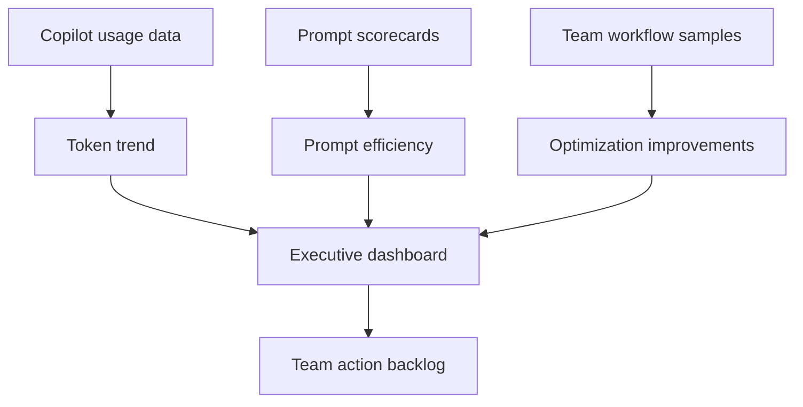

# Metrics Dashboard Concept

## Dashboard Purpose

Provide engineering leaders and developer productivity teams with a practical view of Copilot usage quality, estimated token efficiency, and governance risk.

## Executive View

| Metric | Definition | Target |
| --- | --- | --- |
| Estimated token reduction | Baseline workflow tokens minus optimized workflow tokens. | 20-40% in 60 days. |
| Useful response rate | Percentage of Copilot responses accepted or used after minor edits. | 70%+. |
| Average turns per task | Number of Copilot turns needed to complete common task. | Down 20%. |
| Agent task containment | Agent tasks completing within file/tool/turn budget. | 85%+. |
| MCP tool audit coverage | Percentage of enabled tools reviewed monthly. | 100%. |
| Reusable prompt adoption | Teams using approved prompt templates. | 80%+. |

## Dashboard Layout



## Sample Widgets

| Widget | Visualization | Insight |
| --- | --- | --- |
| Token usage trends | Line chart by week | Detect adoption spikes and context bloat. |
| Cost analysis | Bar chart by team and workflow | Identify high-cost tasks and training needs. |
| Optimization improvements | Before/after waterfall | Show savings from scoped prompts, instructions, MCP cleanup. |
| Team comparisons | Heatmap | Compare teams by useful response rate and prompt score. |
| Prompt efficiency metrics | Scatter plot | Cost per useful answer versus acceptance quality. |
| Agent mode usage | Stacked bar | Separate Ask, Edit, Agent, CLI, and MCP workflows. |

## Prompt Efficiency Formula

Use a simple workshop formula when exact telemetry is unavailable:

```text
Prompt Efficiency Score = Useful Outcome Score / Estimated Token Cost Index
```

Where:

- Useful Outcome Score: 1-5 based on acceptance, correctness, and validation.
- Estimated Token Cost Index: 1-5 based on scope breadth, output size, turns, tools, and history.

## Governance Drilldown

| Risk | Signal | Action |
| --- | --- | --- |
| Long session drift | High average turns per task. | Reset-chat practice and prompt chaining. |
| Tool schema waste | Large enabled MCP tool count. | Monthly MCP audit and tool allowlists. |
| Instruction bloat | Large or frequently changing instructions. | Split always-on, scoped, and on-demand guidance. |
| Agent overuse | Agent mode for simple questions. | Mode routing guide and examples. |
| Output waste | Long explanations for simple tasks. | Output caps in instructions and templates. |
